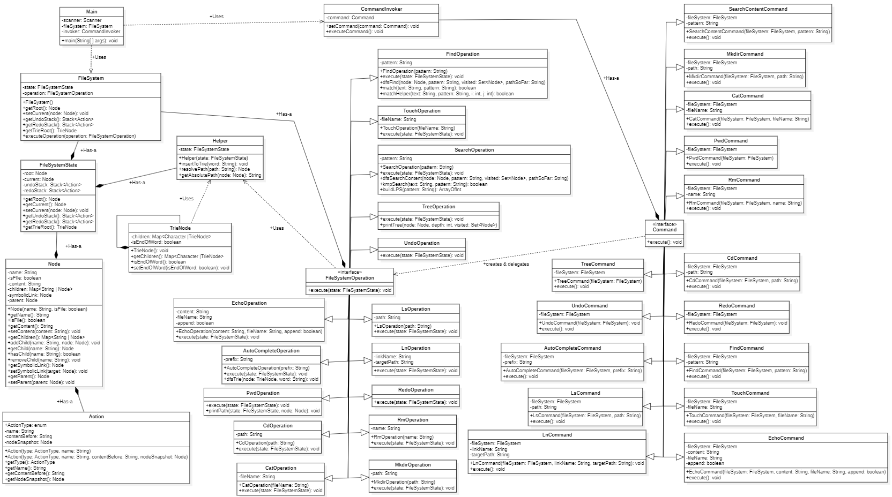

# In-Memory File System  
A console-based in-memory file system built using core Data Structures like Tree, HashMap and Algorithms like String Parsing, Recursion, DFS.  
Simulates Unix-like file operations such as `mkdir`, `cd`, `ls`, `touch`, etc. **Without using the actual file system**.  

## Problem Statement  
Design and implement a file system that:  
- Maintains a virtual folder/file structure in memory.  
- Allows users to create, delete, and navigate directories.  
- Stores file metadata and simulates basic content handling.  
- Lookup and Traversal should be fast.  
- Built using OOP principle.   

## Class Diagram  
   